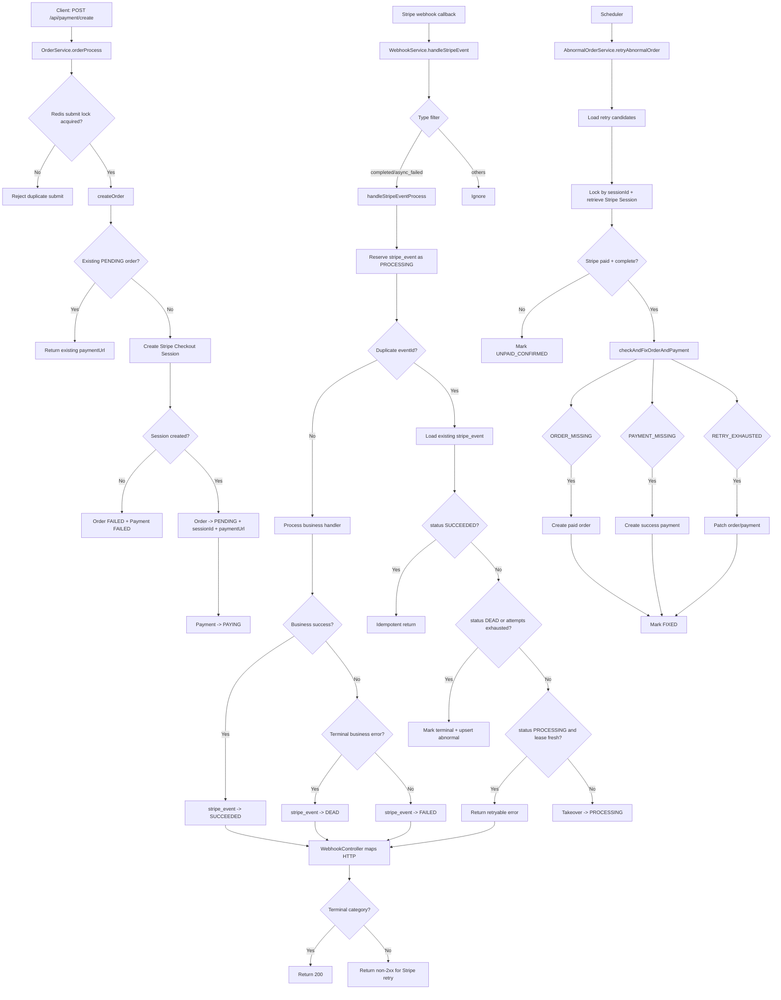

# Commerce Payment Module

## Module Responsibilities Overview
- `PaymentController` accepts payment-create requests and delegates orchestration.
- `OrderService` creates or reuses an order, creates Stripe checkout session, and persists order transitions.
- `PaymentService` maintains local payment ledger states (`INIT`, `PAYING`, `FAILED`, etc.).
- `WebhookController` maps internal error categories to Stripe-facing HTTP responses.
- `WebhookService` handles Stripe callbacks with type filtering, event idempotency, and state transitions.
- `StripeEventService` stores webhook event lifecycle (`PROCESSING`, `SUCCEEDED`, `FAILED`, `DEAD`) for retry control.
- `AbnormalOrderService` stores and reconciles terminal/exhausted abnormal cases.
- `AbnormalOrderReconcileJob` periodically triggers abnormal-order reconciliation.
- `OrderReconcileService` is a safety-net checker for pending orders.
- `StripePaymentService` is a placeholder for Stripe channel-specific adapter logic.

## Core Flow Description
1. Create payment order
- API call enters `POST /api/payment/create`.
- `OrderService.orderProcess` acquires a short Redis lock by `userId:productId`.
- Service reuses an existing `PENDING` order if present; otherwise creates a new `CREATED` order.

2. Initiate payment
- `OrderService.createStripeSession` creates Stripe Checkout Session with metadata (`orderNo`, `userId`, `product`).
- On success, order is updated to `PENDING` with `stripeSessionId` and `paymentUrl`.
- Payment ledger is moved to `PAYING` asynchronously.
- On Stripe session creation failure, order/payment are marked failed.

3. Webhook callback
- `WebhookController` receives `/api/webhook/orderAcceptor`.
- `WebhookService.handleStripeEvent` filters event types and only processes:
  - `checkout.session.completed`
  - `checkout.session.async_payment_failed`

4. Status update and idempotency
- `WebhookService.handleStripeEventProcess` first reserves `stripe_event` as `PROCESSING`.
- Duplicate `eventId` is handled by existing `stripe_event` status:
  - `SUCCEEDED` => idempotent return
  - `DEAD` or retry-exhausted => terminal handling
  - fresh `PROCESSING` => retry later
  - stale `PROCESSING` / `FAILED` => takeover and continue
- For success callback, `handlePaymentSessionSuccess` applies:
  - Redis event key (`stripe:event:{eventId}`)
  - Redisson lock (`session:lock:{sessionId}`)
  - conditional DB updates (`markPaidIfNotPaid`) for order/payment

5. Exception and failure handling
- Terminal business issues (`ORDER_NOT_FOUND`, `PAYMENT_NOT_FOUND`, `RETRY_EXHAUSTED`, etc.) are marked as terminal and returned as HTTP 200.
- Recoverable issues return non-2xx to let Stripe retry.
- Exhausted or terminal cases are upserted into `abnormalOrders` for later reconciliation.

6. Reconciliation
- `AbnormalOrderReconcileJob` runs fixed-delay and calls `AbnormalOrderService.retryAbnormalOrder`.
- Reconcile logic retrieves Stripe Session and applies status-specific repair:
  - `ORDER_MISSING` => create paid order
  - `PAYMENT_MISSING` => create success payment
  - `RETRY_EXHAUSTED` => patch existing order/payment to final success when possible

## Key Design Points
- Idempotency is layered:
  - event-level via `stripeEvents.eventId`
  - cache-level via Redis event key
  - data-level via conditional update SQL (`markPaidIfNotPaid`)
- Concurrency control is layered:
  - Redisson lock by `sessionId`
  - DB pessimistic lock for `stripe_event` row
- Error strategy is explicit:
  - recoverable => keep retry path open
  - terminal/exhausted => move to abnormal pipeline
- Failure trace durability:
  - abnormal upsert uses independent transaction (`REQUIRES_NEW`)
  - event failure/dead updates use upsert path for visibility race tolerance
- Reconcile path is bounded batch processing with retry scheduling fields (`retryCount`, `nextRetryAt`).

## Mermaid Flowchart

