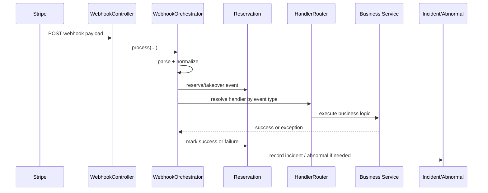

# Commerce Webhook Architecture

## Purpose
This file explains the webhook ingress path from the provider to the local business state.

It is the central "how webhook events are processed" document for the commerce module.

## Main pipeline

## Ingress responsibility
`WebhookController` is intentionally thin.
It just forwards the raw payload and signature to `WebhookOrchestrator`.

The orchestrator owns the real pipeline:
1. parse and normalize provider payload
2. filter unknown events
3. reserve or takeover event ownership
4. route to handler
5. execute business logic
6. classify success or failure
7. write incident / abnormal when needed
8. record metrics

## Event reservation
The webhook path is protected by multiple layers:
- event reservation
- Redis idempotency
- Redisson locks
- conditional database updates / CAS 
- retry / takeover semantics

This is required because webhook delivery is not guaranteed to be ordered or single-shot.

## Unknown event policy
Unknown or not-yet-supported events are accepted and ignored.
The system does this on purpose so unsupported events do not trigger endless provider retries.

## Error policy
`WebhookErrorPolicy` decides how exceptions map to webhook HTTP semantics.

The decision controls whether the provider should:
- stop retrying
- retry later
- consider the event terminal

### Retryable vs terminal
- retryable errors
  - network issues
  - transient provider failures
  - missing business state that may appear later
- terminal errors
  - bad signature
  - bad request shape
  - unsupported provider behavior
  - permanent business mismatch

## Incidents vs abnormal records

These are intentionally separate concepts.

### WebhookIncident
Use this for:
- observability
- dedupe
- alerting
- operational diagnosis

It stores:
- provider
- event id/type
- request id
- correlation ids
- dedupe key
- raw payload
- incident type
- status
- timestamps

### AbnormalOrder
Use this for:
- repairable business debt
- reconcile work
- domain recovery

This is not just an alert.
It is a work item that can be fixed.

## Failure escalation rules
`PaymentFailureEscalationService` is the policy center.
It decides:
- whether an exception should write a `WebhookIncident`
- whether the same failure should also create or update an `AbnormalOrder`
- which abnormal type should be used

### Pre-business failures
Failures before a usable business correlation key exists are treated differently.
They are usually incident-first, not abnormal-first.

### Business-ready failures
Once the system has a correlation key such as `orderNo`, `subscriptionNo`, or provider object id, failures can become repairable abnormal records.

## Why the split matters
If everything is treated as an incident, the system cannot repair business state.
If everything is treated as abnormal, the system loses observability and alerting quality.

The current design keeps both:
- incident for alerting and diagnostics
- abnormal for repair and state recovery

## Metrics
The webhook pipeline records:
- received count
- result count
- duration

This is useful for:
- burst detection
- retry storm detection
- terminal failure tracking
- route-level visibility

## Short summary
Webhook orchestration is a deterministic pipeline with reservation, routing, error policy, incident recording, and optional abnormal repair.
