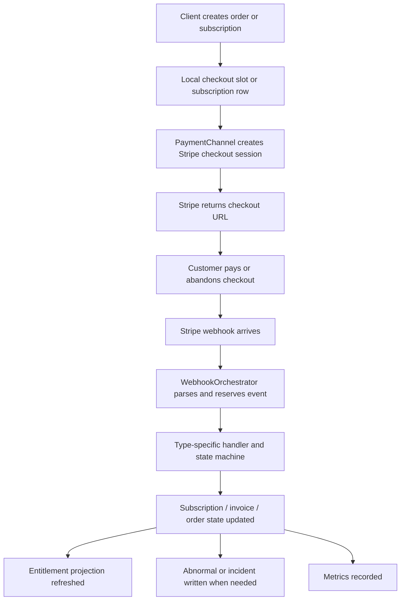

# Commerce Module

## Purpose
This document is the entry guide for the commerce subsystem.
It explains how payment, webhook orchestration, subscription state, invoice facts, entitlement projection, abnormal repair, and observability fit together.

If you are trying to understand the module quickly, read this file first, then open the detailed subdocs:
- `commerce-payment-abstraction.md`
- `commerce-webhook-architecture.md`
- `commerce-subscription-state.md`
- `commerce-entitlement.md`
- `commerce-truth-boundary.md`
- `commerce-abnormal-and-incident.md`
- `commerce-observability.md`

## One-line summary
This module is a Stripe-backed payment and subscription system with explicit state machines, repair paths, and projection-based entitlement.

## The real architecture

The module is not a plain payment adapter.
It is built around four distinct truth layers:

1. **Checkout truth**
   - creation of a checkout session
   - short-lived initialization state
2. **Subscription lifecycle truth**
   - provider subscription status
   - monotonic state transitions
3. **Invoice truth**
   - billing facts
   - current-cycle payment evidence
4. **Projection / access truth**
   - entitlement grants
   - read-model access checks

This separation is the key design rule.

## Main entry points

### HTTP endpoints
- `POST /api/payment/createOrder`
- `POST /api/payment/createSubscription`
- `POST /api/webhook/stripeOrderAcceptor`
- `GET /api/subscription/me`
- `GET /api/subscription/options`
- `GET /api/entitlement/me`
- `GET /api/entitlement/bundles/access`
- `GET /api/entitlement/bundles/{bundleCode}/access`
- `GET /api/entitlement/content/{contentId}/access`

### Main controllers
- `PaymentController`
- `WebhookController`
- `SubscriptionController`
- `EntitlementController`

## Core runtime flow

## The boundaries that matter

### 1. Payment channel boundary
The module depends on `PaymentChannel`, not on Stripe classes directly.
That is what keeps the payment code extensible.

### 2. Webhook orchestration boundary
`WebhookOrchestrator` is the ingress pipeline.
It parses, reserves, routes, executes, records, and classifies the result.

### 3. Subscription boundary
`SubscriptionWebhookStateMachine` decides what is a legal state movement.
It does not write state by itself.

### 4. Invoice boundary
Invoice is fact storage.
It supports entitlement evidence and reconciliation, but it does not own the subscription lifecycle main state.

### 5. Entitlement boundary
Entitlement is the access projection.
It answers "can this user access this resource now?"
It is not the source of truth for subscription lifecycle.

### 6. Repair boundary
Abnormal records and incidents are separate from normal business state.
Repair is handled by reconcile services, not by the happy-path webhooks alone.

## What this module is good at

- explicit state transitions
- deterministic webhook orchestration
- provider abstraction
- retryable vs terminal error decisions
- repairable abnormal order flow
- clear truth boundaries
- metrics for observability

## What to read next

1. `commerce-payment-abstraction.md`
2. `commerce-webhook-architecture.md`
3. `commerce-subscription-state.md`
4. `commerce-entitlement.md`
5. `commerce-truth-boundary.md`
6. `commerce-abnormal-and-incident.md`
7. `commerce-observability.md`

## Short summary
Commerce is a Stripe payment system with a real state machine, a real webhook repair path, and a projection-based entitlement model.
